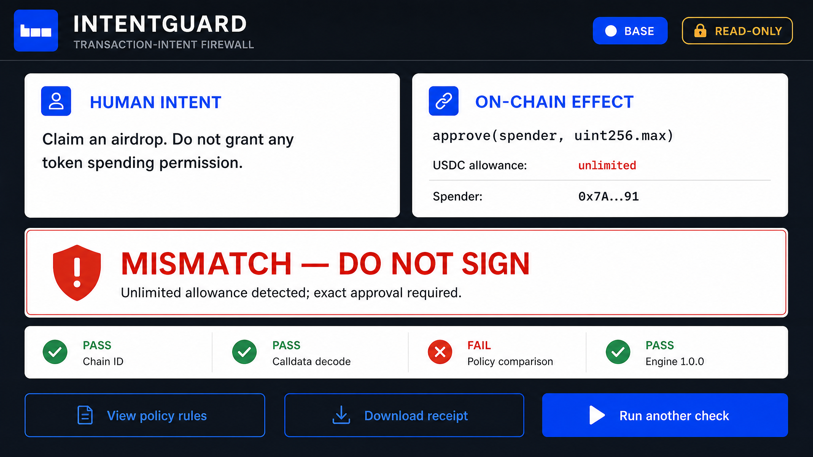
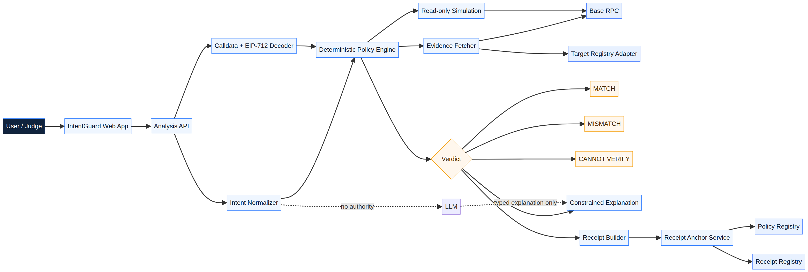

# IntentGuard

> **The transaction-intent firewall for autonomous finance.**
>
> Before a wallet signs, IntentGuard compares what a human meant to do with what the chain is actually being asked to authorize.

**Built for:** Orion Builder Hackathon · **Target chain:** Base / Base Sepolia · **Mode:** Read-only, confirm-first, non-custodial

| In one sentence | What makes it different | What it never does |
|---|---|---|
| IntentGuard turns a plain-language goal into hard limits, decodes a transaction or EIP-712 permit, and returns `MATCH`, `MISMATCH`, or `CANNOT_VERIFY`. | It measures **intent fidelity**: whether the proposed effect matches the human’s explicit authorization. | It never requests private keys, signs transactions, broadcasts transactions, holds user funds, or calls arbitrary targets. |



## Judge’s 60-second path

| Step | What to inspect | Why it matters |
|---:|---|---|
| 1 | Read **The moment** below. | The core user problem becomes immediately concrete. |
| 2 | Run `pnpm test`. | The engine and registries are independently testable. |
| 3 | Open [`engine/src/policy.ts`](engine/src/policy.ts). | Deterministic policy code—not a language model—issues the verdict. |
| 4 | Open [`contracts/IntentGuardReceiptRegistry.sol`](contracts/IntentGuardReceiptRegistry.sol). | Receipts are EIP-712 signed, role-gated, expiring, and revocable. |
| 5 | Review the [pitch material](#judge-materials) and [Base Sepolia checklist](deployments/base-sepolia-checklist.md). | The product, presentation, and testnet path are prepared for evaluation. |

## The moment

A user says:

> “Claim my airdrop. Do not grant any token spending permission.”

The wallet request decodes to:

```solidity
approve(spender, uint256.max)
```

IntentGuard returns:

```text
MISMATCH — DO NOT SIGN
Rule: IG-APPROVE-001
Reason: Unlimited allowance detected; exact approval required.
```

This is not a generic reputation score. It is a direct comparison between **human intent** and **on-chain effect**.

## What the MVP proves

| Scenario | Decoded effect | Expected decision | Why |
|---|---|---|---|
| Exact ERC-20 approval | `approve(trustedSpender, exactAmount)` | `MATCH` | Token, spender, chain, and amount satisfy the declared policy. |
| Unlimited ERC-20 approval | `approve(spender, uint256.max)` | `MISMATCH` | Exact approval is required by default. |
| Wrong spender | Approval sent to an unapproved address | `MISMATCH` | The request violates the spender allowlist. |
| ERC-2612 permit | Signed allowance with owner, spender, value, nonce, and deadline | `MATCH` or `MISMATCH` | The engine checks the typed-data fields against the permit policy. |
| Unknown selector | Unsupported or incomplete calldata | `CANNOT_VERIFY` | The system fails closed rather than guessing. |

> **`MATCH` does not mean “guaranteed safe.”** It means the supplied request matched the supplied policy under the checks implemented by the recorded engine version. The receipt and UI make this limitation explicit.

## Why IntentGuard is an agent, not a chat wrapper

IntentGuard has a deliberate authority boundary. A language model may normalize a user’s text into a strict intent schema and explain an already-computed result. It is never allowed to invent an address, amount, or verdict. The binding decision is produced by deterministic decoding and policy evaluation.

```text
Human goal → Typed intent policy → Calldata / EIP-712 decoder → Evidence → Deterministic rules → Verdict → Versioned receipt
```

**The model explains. Deterministic code decides.**

## Architecture



| Layer | Responsibility | Authority |
|---|---|---|
| **Intent normalizer** | Converts human language into a typed `IntentSpec`. | Provisional; user-confirmable and schema-validated. |
| **Decoder** | Parses supported calldata and EIP-712 permit fields. | Deterministic. |
| **Evidence adapters** | Read Base state, ABI/metadata, and registry evidence. | Read-only inputs; missing evidence is explicit. |
| **Policy engine** | Evaluates typed facts against hard constraints and reason codes. | **Binding verdict authority.** |
| **Explanation layer** | Explains the immutable result in plain language. | No authority to modify the result. |
| **Receipt layer** | Hashes intent/request/evidence and anchors signed proof. | Tamper-evident verification, expiry, and revocation. |

## Trust boundary

| IntentGuard does | IntentGuard does not do |
|---|---|
| Decodes supported transactions and permits. | Ask for seed phrases or private keys. |
| Enforces deterministic policy in its integrated approval flow. | Sign or broadcast a user transaction. |
| Returns `CANNOT_VERIFY` when required evidence is unavailable. | Treat an unknown selector as safe. |
| Anchors policy and receipt commitments on Base Sepolia. | Custody ETH or ERC-20 tokens. |
| Exposes expiry, revocation, and evaluator identity. | Make arbitrary external contract calls. |

A standard externally owned account can still sign in another application. That is an intentional, honest MVP boundary: universal enforcement requires a wallet integration, Safe module, or programmable smart account. IntentGuard is the **confirm-first decision layer** that those future enforcement adapters can consume.

## Repository map

| Path | Judge-relevant content |
|---|---|
| [`engine/src/`](engine/src/) | Typed intent schema, canonical hashing, decoder, deterministic policy engine, and receipt helpers. |
| [`engine/test/engine.test.ts`](engine/test/engine.test.ts) | Exact approval, unlimited approval, wrong spender, permit, unknown-selector, native-value, and receipt tests. |
| [`contracts/`](contracts/) | Policy, receipt, and curated-target registries. |
| [`contracts/test/IntentGuard.test.ts`](contracts/test/IntentGuard.test.ts) | Policy ownership, EIP-712 receipt signature, expiry, revocation, pause, and role tests. |
| [`scripts/deploy.ts`](scripts/deploy.ts) | Deploys all registries and optionally writes a public address manifest. |
| [`scripts/verify-testnet.ts`](scripts/verify-testnet.ts) | Performs real Base Sepolia bytecode, role, policy, signed receipt, validity, and revocation checks. |
| [`deployments/base-sepolia-checklist.md`](deployments/base-sepolia-checklist.md) | Go/no-go checklist and operational deployment process. |
| [`presentation/`](presentation/) | Pitch deck source, wireframes, architecture, speaker notes, and judge-defense rehearsal material. |

## Run it locally

### Requirements

| Tool | Required version |
|---|---:|
| Node.js | 22+ recommended |
| pnpm | 9+ recommended |
| Solidity | Pinned to `0.8.24` by Hardhat |

### Install and validate

```bash
pnpm install
pnpm approve-builds --all
pnpm test
```

The test command compiles the Solidity contracts, runs the Hardhat contract suite, and runs the deterministic TypeScript engine suite.

For separate checks:

```bash
pnpm run compile:contracts
pnpm run lint:types
pnpm run test:contracts
pnpm run test:engine
```

### Minimal analysis example

```ts
import {
  analyze,
  buildErc20ApproveData,
  Verdict,
} from "./engine/src/index";

const result = analyze(
  {
    intent: {
      schemaVersion: 1,
      chainId: 84532,
      action: "APPROVE",
      asset: { address: "0x2222222222222222222222222222222222222222" },
      spendCap: {
        token: "0x2222222222222222222222222222222222222222",
        maxRaw: "100000000000000000000",
      },
      spender: { exact: "0x3333333333333333333333333333333333333333" },
      approvalPolicy: "EXACT_ONLY",
      permitPolicy: "NOT_APPLICABLE",
      allowNativeValue: false,
      allowUnknownSelectors: false,
    },
    request: {
      schemaVersion: 1,
      chainId: 84532,
      from: "0x1111111111111111111111111111111111111111",
      to: "0x2222222222222222222222222222222222222222",
      valueWei: "0",
      data: buildErc20ApproveData(
        "0x3333333333333333333333333333333333333333",
        "100000000000000000000",
      ),
      source: "FIXTURE",
    },
  },
  { chainId: 84532 },
);

console.log(result.verdict === Verdict.MATCH); // true
```

## Deploy and verify on Base Sepolia

The contracts are designed for Base Sepolia development and demonstration. They are not deployed by this repository automatically and should not be presented as deployed until a public manifest and explorer verification are available.

```bash
cp .env.example .env
# Populate only in your local secret manager or shell environment.

pnpm run deploy:testnet
pnpm run verify:testnet
```

The verification script confirms all three deployed contracts have bytecode, checks the relevant roles, creates a test policy, anchors an evaluator-signed EIP-712 mismatch receipt, confirms validity, revokes it, and confirms invalidation. Follow the full [Base Sepolia deployment checklist](deployments/base-sepolia-checklist.md) before running a live testnet flow.

## Smart contracts

| Contract | Role in the system | Safety property |
|---|---|---|
| [`IntentGuardPolicyRegistry`](contracts/IntentGuardPolicyRegistry.sol) | User-owned, versioned policy-hash commitments. | No raw intent text; owner/admin revocation; no funds. |
| [`IntentGuardReceiptRegistry`](contracts/IntentGuardReceiptRegistry.sol) | EIP-712 evaluator-signed evidence receipts. | Role-gated, chain-bound, expiring, revocable, no arbitrary calls. |
| [`IntentGuardTargetRegistry`](contracts/IntentGuardTargetRegistry.sol) | Curated recognized/blocked target metadata. | A recognized target is evidence only; it cannot override a policy mismatch. |

### Roles

| Role | Purpose |
|---|---|
| `DEFAULT_ADMIN_ROLE` | Role governance and production multisig control path. |
| `PAUSER_ROLE` | Stops new receipt anchoring during an incident. |
| `EVALUATOR_ROLE` | Allows a dedicated evaluator to attest signed receipts. |
| `TARGET_MANAGER_ROLE` | Maintains versioned target metadata. |

## Judge materials

| Material | Use it for |
|---|---|
| [Pitch deck outline](presentation/intentguard_pitch_deck.md) | The product story, architecture, live-demo proof, and judge-rubric mapping. |
| [Speaker notes and timing](presentation/speaker_notes_timing_breakdown.md) | A six-minute-ten-second delivery plan with transitions and recovery cues. |
| [Judge Q&A simulation](presentation/judge_qa_simulation_transcript.md) | Live rehearsal against tough technical objections. |
| [Judge defense playbook](presentation/judge_qa_playbook.md) | Concise technical answers, proof references, and red-line claims to avoid. |
| [Wireframes and demo script](presentation/judge_strategy_wireframes_demo_script.md) | Product flow, UI states, presenter choreography, and objection handling. |

## Roadmap after the MVP

| Next step | Why it matters |
|---|---|
| Verified nested-call decoding and read-only simulation | Extends coverage without weakening the fail-closed policy. |
| Wallet and smart-account adapters | Enables explicit policy enforcement in programmable approval flows. |
| Multi-evaluator verification | Reduces single-evaluator trust for high-value actions. |
| Orion Agent Store interface | Makes intent analysis and receipt verification reusable across agents. |

## Security and responsible use

This is a hackathon MVP and has not been audited. Do not deploy it as a production custody, wallet, execution, or safety-guarantee system. For responsible disclosure instructions and scope boundaries, read the [Security Policy](SECURITY.md).

## References

[1]: https://orionagents.org/hackathon "Orion Builder Hackathon"

[2]: https://orionagents.org/docs "Orion Agents Documentation"

[3]: https://eips.ethereum.org/EIPS/eip-712 "EIP-712: Typed Structured Data Hashing and Signing"

[4]: https://eips.ethereum.org/EIPS/eip-2612 "ERC-2612: Permit Extension for EIP-20 Signed Approvals"

[5]: https://docs.soliditylang.org/en/latest/security-considerations.html "Solidity Security Considerations"
